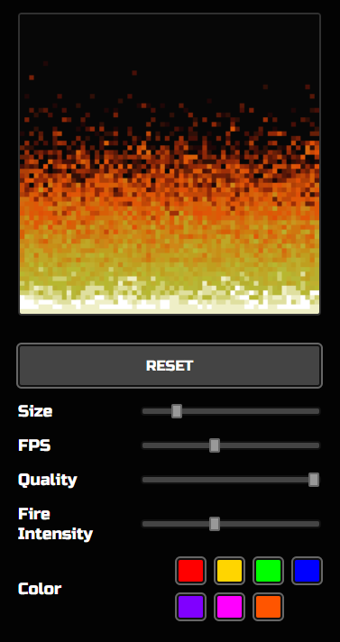

# 🔥 Doom Fire Algorithm 🔥




Implementação do projeto inspirado no vídeo de: [Filipe Deschamps](https://youtu.be/fxm8cadCqbs)

## Sobre

Enquanto assistia ao vídeo de Felipe Deschamps — Tutorial completo de como programar o Fogo do DOOM (JavaScript puro) — decidi criar meu próprio algoritmo baseado nas ideias do vídeo, fazendo minha propria versão com algumas aprimorações.

Durante o projeto, resolvi implementar novas funcionalidades no algoritmo, como botões que interagem dinamicamente com o canvas/fogo, permitindo alterar o tamanho do grid, FPS, qualidade da imagem, intensidade do fogo e a mudança de cor.

O código ainda não está na melhor versão, mas estou sempre aplicando ideias que aprendo durante meu estudo na linguagem.

## Rodando localmente

Clone o projeto

```bash
  git clone https://github.com/ThiagoBkS/doom-fire

```

Entre no diretório do projeto

```bash
  cd doom-fire
```

Rode o comando para buildar o projeto

```bash
  npm run build
```

Abra o arquivo index.html no seu navegador ou instale a extensão [Live Server](https://marketplace.visualstudio.com/items?itemName=ritwickdey.LiveServer) no VSCode.

## Stack utilizada

HTML, CSS, JavaScript

##

Projeto desenvolvido para fins educacionais, incentivando a aprendizagem.
Caso use meu codigo por favor dar os devidos direitos a [@ThiagoBkS](https://github.com/ThiagoBkS)
